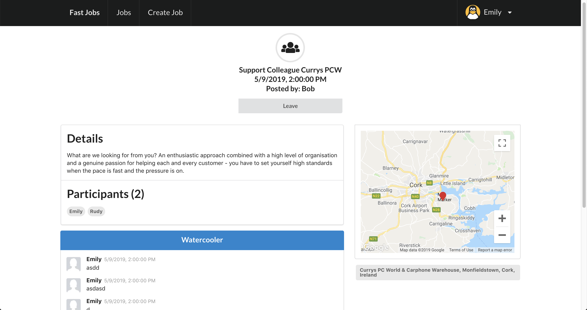

# asg2-react

Name: Rudine Surya Hartanto

website url: https://ess-ewd-asg1.firebaseapp.com/

server: https://github.com/rudinesurya/mern-web-asg2

client: https://github.com/rudinesurya/ess-ewd-asg2-react


## Table of Contents

+ [Overview](#Overview)
    + [App Concept](#App-Concept)
    + [Objectives](#Objectives)

+ [Features](#Features)

+ [Setup Requirements](#Setup-Requirements)
    + [Installation](#Installation)
    + [Configuration](#Configuration)

+ [App Component Design](#App-Component-Design)
+ [UI Design](#UI-Design)
+ [Routing](#Routing)
    + [Protected Routing](#Protected-Routing)
    + [Error Handling](#Error-Handling)

+ [Integration with Backend Api](#Integration-with-Backend-Api)
    + [Axios](#Axios)
        + [Loading the data during ComponentDidMount](#Loading-the-data-during-ComponentDidMount)
        + [Sending the data to the reducer](#Sending-the-data-to-the-reducer)
        + [The reducer store the payload in the state](#The-reducer-store-the-payload-in-the-state)
        + [Mapping the data from redux store to props](#Mapping-the-data-from-redux-store-to-props)
        + [Getting the data from props](#Getting-the-data-from-props)
        
    + [Authentication](#Authentication)
    + [Server Side Validations](#Server-Side-Validations)
    
+ [Deployment](#Deployment)

+ [References](#References)


# Overview
### App Concept
This is an app for quick contract job, similar to the likes of Meetup.
It has some form of social networking feature, eg. the ability to view user's profile and chat
 
### Objectives
 + For the host: Enable quick solution for finding adhoc work done.
 + For the jobseeker: Enable checking out the job details and payment before joining.

# Features
 + CRUD operation
 + List Jobs (Sorting, Filtering)
 + View & Edit Job Detail
 + Chat system in the job page
 + Login / Register
 + View other user's profile
 + Edit self user profile
 + Join / Leave Job
 + Custom Notifications
 + Google Maps and Autocomplete
 + Redux state management
 
# Setup Requirements
### Installation
+ npm install
+ npm start

### Configuration
change the axios.defaults.baseURL (in index.jsx) to your own endpoint


# App Component Design
Only root components are made to be stateful. 
ie, they will have dependencies to 3rd party web api and be passing props down the tree to the stateless children components.


# UI Design
+ Using semantic-ui for its simple and clean ui theme.
+ Public / Private views: certain ui elements will be hidden when user are not authenticated.




# Routing
route | view
--- | ---
/jobs | the job dashboard (homepage)
/job/:id | detail view of a particular job (:id)
/login | login page
/register | registration page
/updateJob/:id | job creation form
/createJob | job creation form
/profile/:id | user profile page
/editProfile/:id | user profile edit form
/error | error page

### Protected Routing
+ /updateJob/:id
+ /createJob
+ /editProfile

### Error Handling
+ Trying to access pages with invalid url or job/user id which does not exist will force the user to be redirected to an error page.
+ Unauthenticated user trying to access protected routes which require authentication, such as job creation or user profile editing page will be redirected to home page.

# Integration with Backend Api
### Axios
Axios is a promise based HTTP client for making HTTP requests from a browser to any web server.
```$xslt
axios.get(‘/url’,{data:’data’}).then((res)=>{
    //on success
}).catch((error)=>{
    //on error
});

axios.post(‘/url’,{data:’data’}).then((res)=>{
    //on success
}).catch((error)=>{
    //on error
});
```
##### Loading the data during ComponentDidMount
When the components loads, this will trigger this lifecycle to fire the loadJobs() action.
```$xslt
componentDidMount() {
    const { loadJobs } = this.props;
    loadJobs();
}
```

##### Sending the data to the reducer
The rest call inside will return a json output, which will be sent as payload to the reducer.
```$xslt
export const loadJobs = () => async (dispatch, getState) => {
  try {
    dispatch({ type: JOB_START_REQUEST });
    const res = await axios.get('/api/jobs');

    dispatch({
      type: LOAD_JOBS,
      payload: res.data,
    });
  } catch (err) {
    dispatch({
      type: JOB_ERROR,
      payload: err.response.data,
    });
  }
};
```
##### The reducer store the payload in the state
The reducer will receive the payload and update its state.
```$xslt
const loadJobs = (state, action) => ({
  ...state,
  loading: false,
  jobs: action.payload,
  error: {},
});
```

##### Mapping the data from redux store to props
In the component, we can access the redux store by connecting this method. And then we can map this data to props for the component to use.
```$xslt
const mapStateToProps = state => ({
  job: state.job,
});
```
##### Getting the data from props
After the mapping, we are free to use the data.
```$xslt
render() {
    const { job } = this.props;
    if (job.loading) return (<Spinner />);

    return (
      <JobList jobs={job.jobs} />
    );
  }
```

### Authentication
Authentication is handled by our backend service using json web token. 
The client app just need to store the token in localstorage to enable the web app to keep the user logged in during page refresh.
This token will be passed to the header of the rest api requests for accessing restricted resources.
The code below enables all axios calls to be set with the authenticated token. If it exists.
```$xslt
const setAuthToken = (token) => {
  if (token) {
    axios.defaults.headers.common.Authorization = `Bearer ${token}`;
  } else {
    delete axios.defaults.headers.common.Authorization;
  }
};
```
### Server Side Validations
All the forms in the app uses server side validations.

When the form gets submitted, it will call a rest call to the endpoint, 
which will then return the result or the error.
The error will then be used to render the error messages on the form.


# References 
https://react.semantic-ui.com/

https://redux.js.org/introduction/getting-started

https://alligator.io/redux/redux-thunk/

https://redux-form.com/8.1.0/docs/gettingstarted.md/

https://github.com/jfairbank/revalidate#readme

https://redux-form.com/8.1.0/examples/react-widgets/

https://github.com/hibiken/react-places-autocomplete

https://github.com/google-map-react/google-map-react
